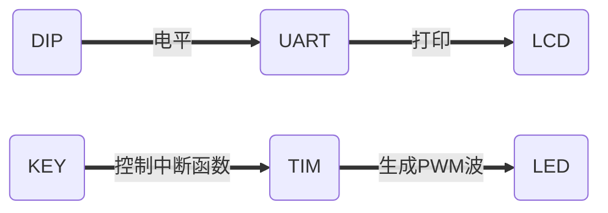

# 微机原理与嵌入式系统——综合实验

赵泊尧 PB18061426

## 需求分析

本次实验要求任意多个模块组合形成一个较为大型的应用系统，我本人设计了一个结合GPIO、定时器、串口以及LCD的综合应用。主要实现的功能有：

1、应用到两个**DIP开关**、**串口通信**以及**LCD模块**，拨动不同的开关实现串口输出不同内容，并将其在LCD中打印出来。

2、应用两个**按键**以及两个**定时器**，实现在普通LED中的呼吸灯，而非直接利用定时器产生的PWM波。

## 功能模块划分

上文中提到的两种功能互不干涉，两个功能对于模块的划分如下：

### 对于功能一：

在这一功能中，我应用到：

**GPIO**的初始化以及读取电平；

**串口**的初始化、中断函数编写以及主函数编写；

和**LCD**模块的初始化这三个模块。

### 对于功能二：

在这一功能中，我应用到：

**GPIO**的初始化以及读取电平；

**定时器**的初始化和中断函数编写这两个模块。

## 设计流程图




## 实现功能核心代码

### 自定义全局变量

```c
char USART_SendBuf[]="Hello!s";
int Len;
int flag[2] = {-1, -1};								//用于记录目前应用系统的状态
```

### 主函数代码

```c
int main(void)
{
	char dip0[] = "DIP0!";
	char dip1[] = "DIP1!";
  	int i;  
  	Len = strlen(USART_SendBuf);	
	//串口、LCD、中断初始化
	NVIC_PriorityGroupConfig(NVIC_PriorityGroup_2);
	delay_init(168);
  	LCD_GPIO_Init();
	LCD_Init();
  	LCD_Clear();
	uart1_init(115200);
	//定时器和LED初始化
	LED_Init();
	TIM3_Init(49999, 71);
	TIM4_Init(99,71);
	//DIP初始化
	DIP_Init();
	//while循环中均为关于功能一的设置
	while(1){
		//LCD_Display_Words(2,1,"PB18061426");
		delay_ms(2000);
		if(DIP0 == 1 && DIP1 == 0){					//如果DIP0为高电平，DIP1为低电平
			flag[1] = 0;							//此时状态为0
			if(flag[0]<0){							//如果此刻是刚刚启动
				flag[0] = 0;						//初始状态为0
				strcpy(USART_SendBuf, dip0);		//串口缓冲区更新为dip0字符串
				Len = strlen(USART_SendBuf);		//更新Len变量
				USART_TX_EN = 1;					//使能发送端
				USART_RX_STA = 0;					//清空缓冲区
			}
			else{
				if(flag[1]!=flag[0]){				//此刻状态与先前不同
					strcpy(USART_SendBuf, dip0);
					Len = strlen(USART_SendBuf);
					USART_TX_EN = 1;
					flag[0] = flag[1];				//更新旧状态
					USART_RX_STA = 0;
				}
			}
		}
		else if(DIP1 == 1 && DIP0 == 0){			//如果DIP1为高电平，DIP0为低电平，以下同理
			flag[1] = 1;
			if(flag[0]<0){
				flag[0] = 1;
				strcpy(USART_SendBuf, dip1);
				Len = strlen(USART_SendBuf);
				USART_TX_EN = 1;
				USART_RX_STA = 0;
			}
			else{
				if(flag[1]!=flag[0]){
					strcpy(USART_SendBuf, dip1);
					Len = strlen(USART_SendBuf);
					USART_TX_EN = 1;
					flag[0] = flag[1];
					USART_RX_STA = 0;
				}
			}
		}
		if(USART_TX_EN)								//串口使能发送
		{
			for(i=0;i<Len;i++)
			{
				USART_SendData(USART1, USART_SendBuf[i]); 				//发送数据		
				while(USART_GetFlagStatus(USART1,USART_FLAG_TXE)!=SET);	//标志位SET为止
			}
			USART_TX_EN=0;							//串口失能发送
		}
		if(USART_RX_STA==Len)						//如果成功接收
			LCD_Display_Words(0,0,USART_RX_BUF);	//打印到LCD上
	}
}
```

### DIP代码

```c
void DIP_Init(void)
{
  GPIO_InitTypeDef  GPIO_InitStructure;
  //使能GPIOE、GPIOF、GPIOC时钟
  RCC_AHB1PeriphClockCmd(RCC_AHB1Periph_GPIOE|RCC_AHB1Periph_GPIOF|RCC_AHB1Periph_GPIOC, ENABLE);
  //以下均为配置引脚
  GPIO_InitStructure.GPIO_Pin  = GPIO_Pin_4 | GPIO_Pin_5 ;  //端口配置    
  GPIO_InitStructure.GPIO_Mode = GPIO_Mode_IN;				//输入模式
  GPIO_InitStructure.GPIO_Speed = GPIO_Speed_100MHz;		//100M高速模式
  GPIO_InitStructure.GPIO_PuPd = GPIO_PuPd_UP;				//上拉模式
  GPIO_Init(GPIOE, &GPIO_InitStructure);					//根据设定参数初始化GPIOE
	 
  GPIO_InitStructure.GPIO_Pin  = GPIO_Pin_14 | GPIO_Pin_15 ;        
  GPIO_InitStructure.GPIO_Mode = GPIO_Mode_IN;
  GPIO_InitStructure.GPIO_Speed = GPIO_Speed_100MHz;//100M
  GPIO_InitStructure.GPIO_PuPd = GPIO_PuPd_UP;
  GPIO_Init(GPIOC, &GPIO_InitStructure);	
		 
  GPIO_InitStructure.GPIO_Pin  = GPIO_Pin_0 | GPIO_Pin_1 | GPIO_Pin_2 | GPIO_Pin_3 ;        
  GPIO_InitStructure.GPIO_Mode = GPIO_Mode_IN;
  GPIO_InitStructure.GPIO_Speed = GPIO_Speed_100MHz;//100M
  GPIO_InitStructure.GPIO_PuPd = GPIO_PuPd_UP;
  GPIO_Init(GPIOF, &GPIO_InitStructure); 
} 
```

### UART代码

```c
u8 USART_RX_BUF[USART_REC_LEN];     
u16 USART_TX_EN=1; 
u16 USART_RX_STA=0; 

void uart1_init(u32 bound){
    GPIO_InitTypeDef GPIO_InitStructure;
	USART_InitTypeDef USART_InitStructure;
	NVIC_InitTypeDef NVIC_InitStructure;
	//时钟使能
	RCC_AHB1PeriphClockCmd(RCC_AHB1Periph_GPIOA,ENABLE); 	
	RCC_APB2PeriphClockCmd(RCC_APB2Periph_USART1,ENABLE);
    //对这几个PIN的寄存器进行初始化设置（引脚复用给串口使用），分别用于收发
	GPIO_PinAFConfig(GPIOA,GPIO_PinSource9,GPIO_AF_USART1); 	
	GPIO_PinAFConfig(GPIOA,GPIO_PinSource10,GPIO_AF_USART1); 	
	//端口初始化
	GPIO_InitStructure.GPIO_Pin = GPIO_Pin_9;
	GPIO_InitStructure.GPIO_Mode = GPIO_Mode_AF;				//模式：复用
	GPIO_InitStructure.GPIO_Speed = GPIO_Speed_50MHz;
	GPIO_InitStructure.GPIO_OType = GPIO_OType_PP; 
	GPIO_Init(GPIOA,&GPIO_InitStructure); 
	
	GPIO_InitStructure.GPIO_Pin =  GPIO_Pin_10; 
	GPIO_InitStructure.GPIO_Mode = GPIO_Mode_AF;				//模式：复用
	GPIO_InitStructure.GPIO_Speed = GPIO_Speed_50MHz;
	GPIO_InitStructure.GPIO_PuPd = GPIO_PuPd_UP;
	GPIO_Init(GPIOA,&GPIO_InitStructure);
	//串口初始化
    USART_InitStructure.USART_BaudRate = bound;					//串口波特率
	USART_InitStructure.USART_WordLength=USART_WordLength_8b;	//串口数据位宽：8bit
	USART_InitStructure.USART_StopBits = USART_StopBits_1;		//串口停止位宽：1bit
	USART_InitStructure.USART_Parity = USART_Parity_No;			//串口奇偶校验：无
	USART_InitStructure.USART_HardwareFlowControl=USART_HardwareFlowControl_None;	//串口硬件流控制：无
	USART_InitStructure.USART_Mode = USART_Mode_Rx | USART_Mode_Tx;	//串口模式：发送&接收
    USART_Init(USART1, &USART_InitStructure); 	
    //使能串口1（USART1）的接收数据中断（USART_IT_RXNE）
	USART_ITConfig(USART1, USART_IT_RXNE, ENABLE);
    
	NVIC_InitStructure.NVIC_IRQChannel = USART1_IRQn;			//中断通道：USART1_IRQn
	NVIC_InitStructure.NVIC_IRQChannelPreemptionPriority=1;	 	//抢占优先级：1
    NVIC_InitStructure.NVIC_IRQChannelSubPriority =1;			//响应优先级：1
	NVIC_InitStructure.NVIC_IRQChannelCmd = ENABLE;				//使能中断
	NVIC_Init(&NVIC_InitStructure);
	USART_Cmd(USART1, ENABLE);	
}

void USART1_IRQHandler(void)                
{
	u8 Res;
	if(USART_GetITStatus(USART1, USART_IT_RXNE) != RESET)  		//判断是否是接收数据中断（USART_IT_RXNE）触发中断
	{
		Res =USART_ReceiveData(USART1);							//读取接收到的数据
		USART_RX_BUF[USART_RX_STA]=Res;							//缓冲区储存收到的数据
		USART_RX_STA++;											//指针向前
		if(USART_RX_STA>(USART_REC_LEN-1)){						//超过最大时，溢出
			USART_RX_STA = 0;
        }
    USART_ClearITPendingBit(USART1, USART_IT_RXNE);				//清除接收数据中断（USART_IT_RXNE）标志位
	}		 
} 
```

### LCD代码

```c
//LCD端口初始化
void LCD_GPIO_Init()
{
  GPIO_InitTypeDef  GPIO_InitStructure;

	RCC_AHB1PeriphClockCmd(RCC_AHB1Periph_GPIOG|RCC_AHB1Periph_GPIOF, ENABLE);//使能GPIO时钟

	GPIO_InitStructure.GPIO_Pin = GPIO_Pin_14 | GPIO_Pin_15;
	GPIO_InitStructure.GPIO_Mode = GPIO_Mode_OUT;
	GPIO_InitStructure.GPIO_OType = GPIO_OType_PP;
	GPIO_InitStructure.GPIO_Speed = GPIO_Speed_100MHz;//100MHz
	GPIO_InitStructure.GPIO_PuPd = GPIO_PuPd_UP;
	GPIO_Init(GPIOF, &GPIO_InitStructure);
	 
	GPIO_InitStructure.GPIO_Pin = GPIO_Pin_1;
	GPIO_InitStructure.GPIO_Mode = GPIO_Mode_OUT;
	GPIO_InitStructure.GPIO_OType = GPIO_OType_PP;
	GPIO_InitStructure.GPIO_Speed = GPIO_Speed_100MHz;//100MHz
	GPIO_InitStructure.GPIO_PuPd = GPIO_PuPd_UP;
	GPIO_Init(GPIOG, &GPIO_InitStructure);
	
	CS = 1;	
    SID = 1;
    SCLK = 1;
}
//发送字节
void SendByte(u8 byte)
{
	u8 i; 
	for(i = 0;i < 8;i++)
    {
		if((byte << i) & 0x80)  //0x80(1000 0000)  			
		{
			SID = 1;           
		}
		else
		{
			SID = 0;        
		}
		SCLK = 0;  
		delay_us(5); 
		SCLK = 1;    
	}   
}
//写命令
void Lcd_WriteCmd(u8 Cmd)
{
     delay_ms(1);    
     SendByte(WRITE_CMD);            //11111,RW(0),RS(0),0   
     SendByte(0xf0&Cmd);      
     SendByte(Cmd<<4);   
}
//写数据
void Lcd_WriteData(u8 Dat)
{
     delay_ms(1);     
     SendByte(WRITE_DAT);           
     SendByte(0xf0&Dat);     
     SendByte(Dat<<4);  
}
//LCD初始化
void LCD_Init(void)
{ 
	delay_ms(50);   	
	Lcd_WriteCmd(0x30);       

	delay_ms(1);
	Lcd_WriteCmd(0x30);      

    delay_ms(1);	
	Lcd_WriteCmd(0x0c);   
 
	delay_ms(1);	
	Lcd_WriteCmd(0x01);     
  
	delay_ms(30);	
	Lcd_WriteCmd(0x06);      
}
//LCD投放字符
void LCD_Display_Words(uint8_t x,uint8_t y,uint8_t*str)
{ 
	Lcd_WriteCmd(LCD_addr[x][y]);
	while(*str>0)
    { 
      Lcd_WriteData(*str);    
      str++;     
    }
}
//LCD投放图片
void LCD_Display_Picture(uint8_t *img)
{
	uint8_t x,y,i;
	Lcd_WriteCmd(0x34);		
	Lcd_WriteCmd(0x34);		
	for(i = 0; i < 2; i++)  
	{
		for(y=0;y<32;y++)   
		{  
			for(x=0;x<8;x++)   
			{
				Lcd_WriteCmd(0x80 + y);		
				Lcd_WriteCmd(0x80 + x+i*0x08);		
				Lcd_WriteData(*img ++);		
 
				Lcd_WriteData(*img ++);		
			}
		}
	}
	Lcd_WriteCmd(0x36);		
	Lcd_WriteCmd(0x30);       
}	
//LCD清屏
void LCD_Clear(void)
{
	Lcd_WriteCmd(0x01);			
	delay_ms(2);				
}

```

### KEY代码

```c
//与DIP初始化类似
void KEY_Init(void)
{
	 GPIO_InitTypeDef  GPIO_InitStructure;   //GPIO初始化结构体
	 RCC_AHB1PeriphClockCmd(RCC_AHB1Periph_GPIOE, ENABLE);//使能GPIO时钟

	 GPIO_InitStructure.GPIO_Pin = GPIO_Pin_0|GPIO_Pin_1;				 
	 GPIO_InitStructure.GPIO_Mode = GPIO_Mode_IN;
     GPIO_InitStructure.GPIO_OType = GPIO_OType_PP;
     GPIO_InitStructure.GPIO_Speed = GPIO_Speed_100MHz;
     GPIO_InitStructure.GPIO_PuPd = GPIO_PuPd_UP;
     GPIO_Init(GPIOE, &GPIO_InitStructure);
     GPIO_ResetBits(GPIOE, GPIO_Pin_0|GPIO_Pin_1);
}
```

### TIM代码

```c
u8 DutyCycle=0,flag1=0,flag2=0,flag3=0;	//定义PWM波占空比，设定范围：0-100

void TIM3_Init(u16 arr,  u16 psc)
{
	TIM_TimeBaseInitTypeDef  TIM_TimeBaseInitStructure; 
	NVIC_InitTypeDef  NVIC_InitStructure;
	RCC_APB1PeriphClockCmd(RCC_APB1Periph_TIM3,ENABLE);	//使能定时器3（TIM3）时钟
	TIM_TimeBaseInitStructure.TIM_Period = arr; 		//定时器计数阈值
	TIM_TimeBaseInitStructure.TIM_Prescaler=psc;		//定时器时钟预分频值
	TIM_TimeBaseInitStructure.TIM_CounterMode=TIM_CounterMode_Up; //向上计数
    //设置定时器时钟(CK_INT)频率与数字滤波器(ETR，TIx)使用的采样频率之间的分频比例
	TIM_TimeBaseInitStructure.TIM_ClockDivision=TIM_CKD_DIV1;
    
    //将结构体(TIM_TimeBaseInitStructture)的设定写入TIM3配置寄存器 
	TIM_TimeBaseInit(TIM3,&TIM_TimeBaseInitStructure);
    
	TIM_ITConfig(TIM3,TIM_IT_Update,ENABLE); //使能定时器3（TIM3）的计数溢出中断（TIM_IT_Update）
    
	NVIC_InitStructure.NVIC_IRQChannel=TIM3_IRQn; //选定中断通道：定时器3中断（TIM3_IRQn）
	NVIC_InitStructure.NVIC_IRQChannelPreemptionPriority=0x01;	//该中断通道抢占优先级：1
	NVIC_InitStructure.NVIC_IRQChannelSubPriority=0x03; //该中断通道响应优先级：3
	NVIC_InitStructure.NVIC_IRQChannelCmd=ENABLE; 		//使能该中断通道
	NVIC_Init(&NVIC_InitStructure);// 将结构体(NVIC_InitStructture)的设定写入NVIC控制寄存器
	
	TIM_Cmd(TIM3,ENABLE); //使能定时器3：TIM3按照上述设定开始工作
}


void TIM3_IRQHandler(void)
{
	if(TIM_GetITStatus(TIM3,TIM_IT_Update)!=RESET) //判断定时器3（TIM3）是否发生计数溢出中断（TIM_IT_Update）
	{
		if(flag3 == 0){
			if(KEY0 == 0)	flag1 = (flag1+1)%3;	//按键1按下时，flag1发生变化，控制亮灯
			if(KEY1 == 0)	flag2 = (flag2+1)%3;	//按键2按下时，flag2发生变化，控制占空比（DutyCycle）变化速度
			
			TIM_ClearITPendingBit(TIM3, TIM_IT_Update);			//清除定时器3（TIM3）的计数溢出中断（TIM_IT_Update）标志。如未清除，将重复进入此中断服务函数
		}
		if(KEY0 == 0||KEY1 == 0) flag3=1;
		else if(KEY0==1&&KEY1==1) flag3=0;
	}
}

void TIM4_Init(u16 arr,  u16 psc)
{
	TIM_TimeBaseInitTypeDef  TIM_TimeBaseInitStructure; 
	NVIC_InitTypeDef  NVIC_InitStructure;
	RCC_APB1PeriphClockCmd(RCC_APB1Periph_TIM4,ENABLE);
	TIM_TimeBaseInitStructure.TIM_Period = arr; 
	TIM_TimeBaseInitStructure.TIM_Prescaler=psc;	
	TIM_TimeBaseInitStructure.TIM_CounterMode=TIM_CounterMode_Up; 
	TIM_TimeBaseInitStructure.TIM_ClockDivision=TIM_CKD_DIV1;
	
	TIM_TimeBaseInit(TIM4,&TIM_TimeBaseInitStructure); 
	TIM_ITConfig(TIM4,TIM_IT_Update,ENABLE); 
	NVIC_InitStructure.NVIC_IRQChannel=TIM4_IRQn; 
	NVIC_InitStructure.NVIC_IRQChannelPreemptionPriority=0x01;
	NVIC_InitStructure.NVIC_IRQChannelSubPriority=0x03;
	NVIC_InitStructure.NVIC_IRQChannelCmd=ENABLE; 
	NVIC_Init(&NVIC_InitStructure);
	
	TIM_Cmd(TIM4,ENABLE);
}

u8 count=0;						//计数
u8 control_dir=1;				//计数方向

void TIM4_IRQHandler(void)
{
	if(TIM_GetITStatus(TIM4,TIM_IT_Update)!=RESET)
	{
		if(count==100) {				
			count=0;
			if(control_dir==1){
				DutyCycle+=(flag2+1);
				if(DutyCycle>=100) 
					control_dir=0;
			}
			if(control_dir==0){
				DutyCycle-=(flag2+1);
				if(DutyCycle<=0) 
					control_dir=1;
			}
		}
		else 
			count++;
		switch(flag1){
			case 0:
			
				if(count<DutyCycle) {
					LED1 = 0;
					LED2 = 0;
					LED3 = 1;
				}
				else {
					LED1 = 0;
					LED2 = 0;
					LED3 = 0;
				}
				break;
			case 1:
			
				if(count<DutyCycle) {
					LED1 = 0;
					LED2 = 1;
					LED3 = 0;
				}
				else {
					LED1 = 0;
					LED2 = 0;
					LED3 = 0;
				}
				break;
			case 2:
			
				if(count<DutyCycle) {
					LED1 = 1;
					LED2 = 0;
					LED3 = 0;
				}
				else {
					LED1 = 0;
					LED2 = 0;
					LED3 = 0;
				}
				break;
		}
	}
	TIM_ClearITPendingBit(TIM4,TIM_IT_Update);
}

```


## 总结

这个实验同过五个小模块的配合实现了两个功能：

1、应用到两个**DIP开关**、**串口通信**以及**LCD模块**，拨动不同的开关实现串口输出不同内容，并将其在LCD中打印出来。

2、应用两个**按键**以及两个**定时器**，实现在普通LED中的呼吸灯，而非直接利用定时器产生的PWM波。

学会了如何应用Keil5去dubug和查看各个模块地址。